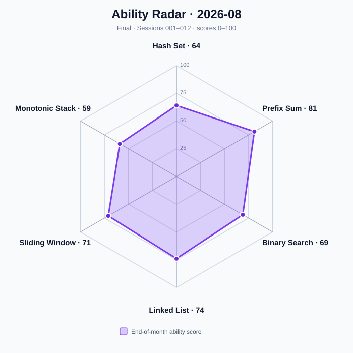
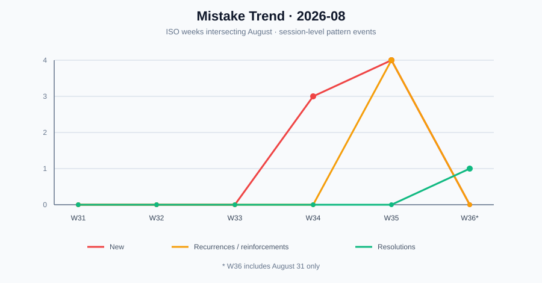

# Algorithm Training Monthly Report — 2026-08

Period: 2026-08-01 to 2026-08-31
Timezone: Asia/Shanghai
Status: Final
Generated: 2026-09-02
Source Sessions: session001.md, session002.md, session003.md, session004.md, session005.md, session006.md, session007.md, session008.md, session009.md, session010.md, session011.md, session012.md

August established the foundation-stage baseline and produced measurable gains across all six tracked topics. The most important movement was not task volume: Prefix Sum reached 81 and became the first topic assigned Level 2 work, while Monotonic Stack and Sliding Window graduated to Mastered. Review timeliness and recurring complexity-accounting errors remain the main constraints on further difficulty increases.

## Capability Summary

| Topic | Start Score | End Score | Change | Start Level | End Level | End Status |
| --- | ---: | ---: | ---: | --- | --- | --- |
| Hash Set | 50 | 64 | +14 | C | C | Review |
| Prefix Sum | 50 | 81 | +31 | C | A | Review |
| Sliding Window | 50 | 71 | +21 | C | B | Mastered |
| Binary Search | 50 | 69 | +19 | C | B | Review |
| Monotonic Stack | 50 | 59 | +9 | C | C | Mastered |
| Linked List | 50 | 74 | +24 | C | B | Review |

## Difficulty Trajectory

| Topic | Start | End | August Trajectory |
| --- | --- | ---: | --- |
| Hash Set | Not available | 1 | Initialized at Level 1 in Session 007 |
| Prefix Sum | Not available | 2 | Initialized at 1, then raised 1 → 2 in Session 012 |
| Sliding Window | Not available | 1 | Initialized at Level 1 in Session 010 |
| Binary Search | Not available | 1 | Initialized at Level 1 in Session 009 |
| Monotonic Stack | Not available | 1 | Initialized at Level 1 in Session 004 and held |
| Linked List | Not available | 1 | Initialized at Level 1 in Session 011 |

Prefix Sum was the only topic to satisfy the evidence threshold for a difficulty increase during August. Difficulty remains topic-specific rather than a single global level.

## Workload and Rating Mix

| Metric | Value | Denominator / Evidence |
| --- | ---: | --- |
| Assigned tasks | 39 | 36 A/B/R tasks plus 3 supplemental discrimination questions |
| Completed tasks | 39 | session001–session012 |
| A tasks | 12 | One per session |
| B tasks | 12 | One per session |
| R tasks | 12 | One per session |
| Supplemental questions | 3 | Session 003 Q1–Q3 |
| Independent AC rate | 91.4% | 32/35 tasks with an AC outcome; one R task was explanation-only |

| Rating | Count |
| --- | ---: |
| S | 16 |
| A | 15 |
| B | 1 |
| C | 4 |
| D | 0 |
| Unrated supplemental questions | 3 |

## Efficiency and Assistance

| Metric | Value | Reported denominator |
| --- | ---: | ---: |
| Median actual-time / budget ratio | 0.40 | 20/24 A/B tasks had both values reported |
| Average hint count | 0.16 | 31 completed tasks reported numeric hint counts |
| Strongest hint — None | 26 | 36 A/B/R tasks |
| Strongest hint — Explicit algorithm | 4 | 36 A/B/R tasks |
| Strongest hint — Not reported | 6 | 36 A/B/R tasks |
| Substantial wrong approaches | 5 | 20/24 A/B tasks had usable counts |
| Average performance index | 0.93 | 18/24 A/B tasks had computable indices |

Unavailable values are excluded rather than treated as zero.

## Graduation and Relearning

| Event | Session | Evidence |
| --- | --- | --- |
| Monotonic Stack → Mastered | Session 008 | Recent five contained three S, no D, and a discrimination task |
| Sliding Window → Mastered | Session 010 | Recent five contained three S, no D, and a discrimination task |
| Relearning transitions | None | No Mastered topic produced a qualifying failure during August |

## Review Adherence

| Metric | Count / Rate |
| --- | ---: |
| Review obligations due through 2026-08-31 | 13 |
| Completed reviews | 11 |
| Completed on time | 2 |
| Outstanding at month end | 2 |
| On-time adherence rate | 15.4% (2/13) |

The two outstanding obligations at month end were Hash Set due 2026-08-29 and Monotonic Stack due 2026-08-30. Review debt, rather than failure to complete new tasks, is the clearest process weakness.

## Mistake Patterns

| Category | Count | Evidence |
| --- | ---: | --- |
| New patterns | 7 | Sessions 001–011 |
| Recurrences / reinforcements | 4 | W35 pattern events |
| Resolved patterns | 1 | Prefix definition and interval-boundary pattern resolved in Session 012 |

### Most Frequent Active Patterns at Month End

| Pattern | Recorded Occurrences | Latest August Evidence |
| --- | ---: | --- |
| 复杂度结论未逐层对应实际操作成本 | 5 | Session 009 — LeetCode 875 |
| 未区分目标关系就把含负数子数组统一归为前缀和加哈希 | 2 | Session 006 — LeetCode 930 |
| 链表改指针前未主动固定后继可达性与终止不变量 | 2 | Session 011 — LeetCode 143 |

## Workload Trend

| ISO Week | Covered August Dates | Assigned | Completed |
| --- | --- | ---: | ---: |
| 2026-W34 | 2026-08-17 to 2026-08-23 | 15 | 15 |
| 2026-W35 | 2026-08-24 to 2026-08-30 | 21 | 21 |
| 2026-W36 | 2026-08-31 only | 3 | 3 |

No July training sessions are available, so preceding-month workload comparisons are not inferred.

## Ability Radar

| Axis | Score |
| --- | ---: |
| Hash Set | 64 |
| Prefix Sum | 81 |
| Binary Search | 69 |
| Linked List | 74 |
| Sliding Window | 71 |
| Monotonic Stack | 59 |

## Mistake Trend

| ISO Week | New | Recurrences / Reinforcements | Resolutions |
| --- | ---: | ---: | ---: |
| 2026-W31 | 0 | 0 | 0 |
| 2026-W32 | 0 | 0 | 0 |
| 2026-W33 | 0 | 0 | 0 |
| 2026-W34 | 3 | 0 | 0 |
| 2026-W35 | 4 | 4 | 0 |
| 2026-W36 (August portion) | 0 | 0 | 1 |

No July session evidence is available; the chart therefore begins with the ISO weeks that intersect August. No causal trend is inferred.

## September Priorities

1. Clear overdue Hash Set and Monotonic Stack reviews before adding further review debt.
2. Use Level 2 Prefix Sum tasks to test transfer while continuing to require explicit invariants and space costs.
3. Treat complexity as a proof obligation: identify the true iteration domain, helper-operation cost, and whether inner work is uniquely charged before accepting O(n).
