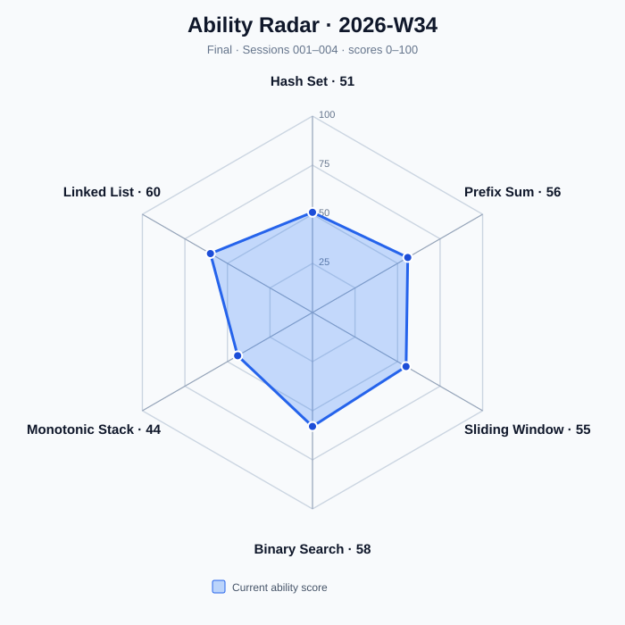
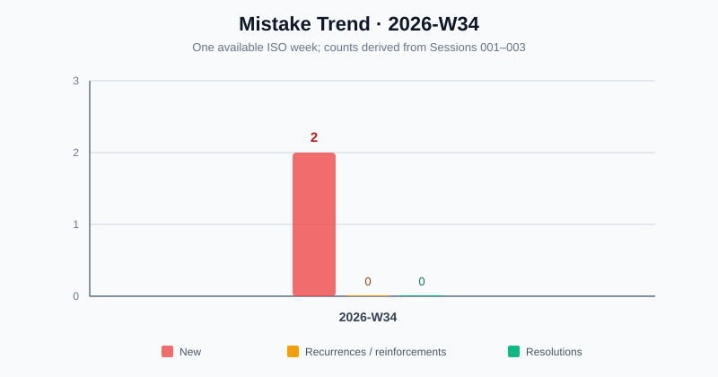

# Algorithm Training Weekly Report — 2026-W34

Period: 2026-08-17 to 2026-08-23
Timezone: Asia/Shanghai
Status: Partial
Generated: 2026-08-23
Source Sessions: session001.md, session002.md, session003.md

This partial report covers the three archived diagnostic sessions through 2026-08-22. All aggregates below are derived from those immutable session records; current topic scores are cross-checked against `STATE.md`.

## Workload and Task Mix

| Metric | Value | Denominator / Evidence |
| --- | ---: | --- |
| Assigned tasks | 12 | 9 A/B/R tasks + 3 supplemental discrimination questions |
| Completed tasks | 12 | session001–session003 |
| A tasks | 3 | One per session |
| B tasks | 3 | One per session |
| R tasks | 3 | One per session |
| Supplemental discrimination questions | 3 | Session 003 Q1–Q3 |
| Independent AC rate | 75% | 6/8 tasks reporting AC status; Session 003 R was explanation-only |

## Rating Distribution

| Rating | Count | Source A/B/R tasks |
| --- | ---: | --- |
| S | 5 | session001: 209; session002: 875, 560; session003: 206, 143 |
| A | 2 | session001: 128; session003: 875 review |
| B | 1 | session001: 560 |
| C | 1 | session002: 739 |
| D | 0 | None |
| Unrated supplemental questions | 3 | Session 003 Q1–Q3 |

## Efficiency and Assistance

| Metric | Value | Reported denominator |
| --- | ---: | ---: |
| Median actual-time / budget ratio | 0.71 | 2 tasks with both values reported |
| Average hint count | 0.33 | 3 tasks with numeric hint counts |
| Strongest hint — None | 2 | 9 A/B/R tasks |
| Strongest hint — Explicit algorithm | 1 | 9 A/B/R tasks |
| Strongest hint — Not reported | 6 | 9 A/B/R tasks |
| Substantial wrong approaches | 2 | 2 tasks reported one each; remaining tasks unavailable |
| Average performance index | Not available | 0/6 A/B tasks had assigned difficulty |

The median ratio uses 0.50 for Session 001 / LeetCode 128 and 32/35 ≈ 0.91 for Session 001 / LeetCode 560. Missing times, budgets, hints, and errors are not treated as zero.

## Topic Movement

| Topic | Start | End | Change | End Level | Status | Recommended Difficulty |
| --- | ---: | ---: | ---: | --- | --- | --- |
| Hash Set | 50 | 53 | +3 | C | Training | Not available |
| Prefix Sum | 50 | 56 | +6 | C | Review | Not available |
| Sliding Window | 50 | 55 | +5 | C | Training | Not available |
| Binary Search | 50 | 58 | +8 | C | Review | Not available |
| Monotonic Stack | 50 | 48 | -2 | C | Training | Not available |
| Linked List | 50 | 60 | +10 | C | Training | Not available |

No recommended-difficulty trajectory is available because assigned task difficulties were not reported in the diagnostic sessions.

## Review Adherence

| Metric | Count |
| --- | ---: |
| Review obligations due through 2026-08-22 | 5 |
| Completed reviews | 2 |
| Completed on time | 2 |
| Outstanding overdue reviews | 3 |

Completed on time: Prefix Sum / LeetCode 560 and Binary Search / LeetCode 875. Outstanding: Hash Set / 128, Sliding Window / 209, and Monotonic Stack / 739.

## Mistake Patterns

| Category | Count | Patterns |
| --- | ---: | --- |
| New | 2 | 连续子数组求和直接使用滑动窗口；未验证值域覆盖与出现次数条件就使用总和差 |
| Recurring / reinforced | 0 | None |
| Resolved | 0 | None |

## Ability Radar

| Axis | Score |
| --- | ---: |
| Hash Set | 53 |
| Prefix Sum | 56 |
| Sliding Window | 55 |
| Binary Search | 58 |
| Monotonic Stack | 48 |
| Linked List | 60 |

The chart uses end-of-period topic scores on a 0–100 scale. All six active topics are shown.

## Mistake Trend

| ISO Week | New | Recurrences / Reinforcements | Resolutions |
| --- | ---: | ---: | ---: |
| 2026-W34 | 2 | 0 | 0 |

Only one week of archived evidence is available; no causal trend is inferred.

## Next Focus

1. Test model recognition without revealing the algorithm family, especially Monotonic Stack and constraint-driven duplicate detection.
2. Complete overdue reviews for LeetCode 128, 209, and 739 before increasing acquisition difficulty.
3. Preserve Linked List strength by requiring pointer invariants and space-complexity explanations, not AC alone.

