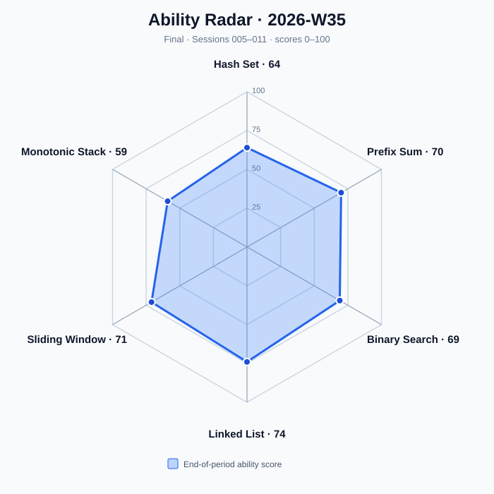
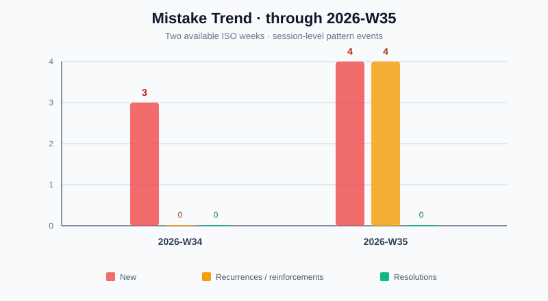

# Algorithm Training Weekly Report — 2026-W35

Period: 2026-08-24 to 2026-08-30
Timezone: Asia/Shanghai
Status: Final
Generated: 2026-08-31
Source Sessions: session005.md, session006.md, session007.md, session008.md, session009.md, session010.md, session011.md

This final report covers seven consecutive foundation-stage sessions. All aggregates are derived from the seven immutable session records; end scores are cross-checked against the state captured after Session 011. Session 012 belongs to 2026-W36 and is excluded from every W35 metric.

## Workload and Task Mix

| Metric | Value | Denominator / Evidence |
| --- | ---: | --- |
| Assigned tasks | 21 | Seven sessions with one A, one B, and one R task each |
| Completed tasks | 21 | session005–session011 |
| A tasks | 7 | One per session |
| B tasks | 7 | One per session |
| R tasks | 7 | One per session |
| Independent AC rate | 100% | 21/21 completed A/B/R tasks |

## Rating Distribution

| Rating | Count | Source A/B/R tasks |
| --- | ---: | --- |
| S | 10 | session005: 901, 121; session007: 349, 350; session008: 303, 739; session009: 704; session010: 643, 219; session011: 21 |
| A | 11 | session005: 209; session006: 930, 724, 143; session007: 128; session008: 2574; session009: 35, 875; session010: 209; session011: 203, 143 |
| B | 0 | None |
| C | 0 | None |
| D | 0 | None |

## Efficiency and Assistance

| Metric | Value | Reported denominator |
| --- | ---: | ---: |
| Median actual-time / budget ratio | 0.27 | 14/14 A/B tasks had both values reported |
| Average hint count | 0.00 | 21/21 completed tasks reported numeric hint counts |
| Strongest hint — None | 21 | 21/21 completed tasks |
| Substantial wrong approaches | 1 | 14/14 A/B tasks reported counts; Session 011 / LeetCode 203 contributed the only one |
| Average performance index | 0.97 | 14/14 A/B tasks had complete indices |

R tasks are excluded from the time/budget ratio because they have no assigned time-budget field. Missing values are not treated as zero.

## Topic Movement

| Topic | Start | End | Change | End Level | End Status | Recommended Difficulty |
| --- | ---: | ---: | ---: | --- | --- | --- |
| Hash Set | 51 | 64 | +13 | C | Review | Not available → 1 |
| Prefix Sum | 56 | 70 | +14 | B | Review | Not available → 1 |
| Sliding Window | 55 | 71 | +16 | B | Mastered | Not available → 1 |
| Binary Search | 58 | 69 | +11 | B | Review | Not available → 1 |
| Monotonic Stack | 44 | 59 | +15 | C | Mastered | 1 → 1 |
| Linked List | 60 | 74 | +14 | B | Review | Not available → 1 |

Monotonic Stack graduated in Session 008 and Sliding Window graduated in Session 010. Every topic improved its score during W35; recommended task levels stayed conservative while comparable Level 1 evidence accumulated.

## Review Adherence

| Metric | Count |
| --- | ---: |
| Review obligations due through 2026-08-30 | 10 |
| Completed reviews | 7 |
| Completed on time | 0 |
| Outstanding overdue reviews at period end | 3 |

The seven completed R tasks were LeetCode 209, 143, 128, 739, 875, 209, and 143; every one was completed after its scheduled date. At period end, Prefix Sum was overdue from 2026-08-28, Hash Set from 2026-08-29, and Monotonic Stack from 2026-08-30.

## Mistake Patterns

| Category | Count | Patterns / occurrences |
| --- | ---: | --- |
| New | 4 | 目标关系未区分；前缀定义与边界未固定；二分只证明收敛；链表后继可达性与终止不变量未固定 |
| Recurring / reinforced | 4 | 目标关系 1 次；复杂度成本分层 2 次；前缀边界 1 次 |
| Resolved | 0 | None |

## Ability Radar

| Axis | Score |
| --- | ---: |
| Hash Set | 64 |
| Prefix Sum | 70 |
| Binary Search | 69 |
| Linked List | 74 |
| Sliding Window | 71 |
| Monotonic Stack | 59 |

The chart uses end-of-period scores and places active Review topics before Mastered topics.

## Mistake Trend

| ISO Week | New | Recurrences / Reinforcements | Resolutions |
| --- | ---: | ---: | ---: |
| 2026-W34 | 3 | 0 | 0 |
| 2026-W35 | 4 | 4 | 0 |

Only two archived ISO weeks are available, so no causal trend is inferred.

## Next Focus

1. Clear the overdue Prefix Sum review first, then the Hash Set and Monotonic Stack obligations, instead of allowing review debt to accumulate.
2. Require the first explanation to state the maintained invariant, boundary membership, and extra-space cost; fast AC alone is not enough for an S rating.
3. After enough stable comparable evidence, move selected topics from introductory mechanics to basic-transfer tasks rather than raising all topics together.
